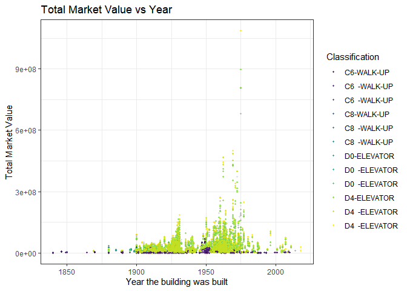
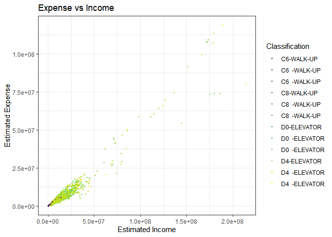
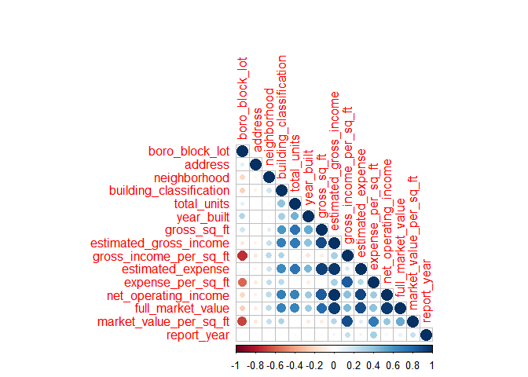

processing
================
2022-11-25

# Preprocessing

## parts to be completed (add as your wish)

| Contents                          | Stage | Comments                |
|-----------------------------------|-------|-------------------------|
| separate observations             | √     |                         |
| NAs (error value)                 |       | na.omit()  other error? |
| add explanations to each variable |       |                         |
| link the address to lat&lon       |       | other ways to plot map? |
| simple scatter/box plots          |       |                         |

``` r
library(tidyverse)
library(corrplot)
```

In the origin data, each properties are compared with three comparable
rentals. So in total, information of four building(sets) forms one
observation.

``` r
comparable_rental_income_raw = read_csv("data/DOF__Cooperative_Comparable_Rental_Income__Citywide.csv") %>%
  janitor::clean_names()
```

    ## Rows: 44960 Columns: 60
    ## ── Column specification ────────────────────────────────────────────────────────
    ## Delimiter: ","
    ## chr (16): Boro-Block-Lot, Address, Neighborhood, Building Classification, Bo...
    ## dbl (44): Total Units, Year Built, Gross SqFt, Estimated Gross Income, Gross...
    ## 
    ## ℹ Use `spec()` to retrieve the full column specification for this data.
    ## ℹ Specify the column types or set `show_col_types = FALSE` to quiet this message.

``` r
head(comparable_rental_income_raw)
```

    ## # A tibble: 6 × 60
    ##   boro_block_lot address neigh…¹ build…² total…³ year_…⁴ gross…⁵ estim…⁶ gross…⁷
    ##   <chr>          <chr>   <chr>   <chr>     <dbl>   <dbl>   <dbl>   <dbl>   <dbl>
    ## 1 1-00011-0014   26 BEA… FINANC… D4  -E…      21    1909   51387  2.40e6    46.7
    ## 2 1-00028-0001   3 HANO… FINANC… D0  -E…     211    1926  239121  9.46e6    39.6
    ## 3 1-00094-0001   80 GOL… SOUTHB… D4  -E…    1652    1971 2155492  6.81e7    31.6
    ## 4 1-00100-0026   138 NA… SOUTHB… D4  -E…      43    1901   79422  3.13e6    39.4
    ## 5 1-00117-0001   185 PA… CIVIC … D4  -E…     465    1960  515425  2.59e7    50.2
    ## 6 1-00134-0025   258 BR… CIVIC … D4  -E…      45    1915   88320  4.24e6    48  
    ## # … with 51 more variables: estimated_expense <dbl>, expense_per_sq_ft <dbl>,
    ## #   net_operating_income <dbl>, full_market_value <dbl>,
    ## #   market_value_per_sq_ft <dbl>, boro_block_lot_1 <chr>, address_1 <chr>,
    ## #   neighborhood_1 <chr>, building_classification_1 <chr>, total_units_1 <dbl>,
    ## #   year_built_1 <dbl>, gross_sq_ft_1 <dbl>, estimated_gross_income_1 <dbl>,
    ## #   gross_income_per_sq_ft_1 <dbl>, estimated_expense_1 <dbl>,
    ## #   expense_per_sq_ft_1 <dbl>, net_operating_income_1 <dbl>, …

### Seperate the observations:

so I would like to separate one and 3 comparables with into four subset
with same variable names for further processing.

delete `distance_from_co_op_in_miles*` to make the variables consistent
to each other.

``` r
namelist = comparable_rental_income_raw %>%
  select(-c("distance_from_co_op_in_miles","distance_from_co_op_in_miles_1","distance_from_co_op_in_miles_2")) %>%
  colnames()

## to be optimized 

rentalincom_ori = comparable_rental_income_raw %>%
  select(append(namelist[1:14],"report_year"))

std_colname = colnames(rentalincom_ori)

rentalincom_c1 = comparable_rental_income_raw %>%
  select(append(namelist[15:28],"report_year"))
colnames(rentalincom_c1) = std_colname

rentalincom_c2 = comparable_rental_income_raw %>%
  select(append(namelist[29:42],"report_year"))
colnames(rentalincom_c2) = std_colname
  
rentalincom_c3 = comparable_rental_income_raw %>%
  select(append(namelist[43:56],"report_year"))
colnames(rentalincom_c3) = std_colname

transormed_rental_income = rbind(rentalincom_ori,rentalincom_c1,rentalincom_c2,rentalincom_c3)
```

### clean data

``` r
transormed_rental_income = transormed_rental_income %>% 
  na.omit() 

save(transormed_rental_income, file = "data/cleaned_data.RData")
```

### Data description

Boro-Block-Lot: Borough-Block-Lot(BBL) location

``` r
comparable_rental_income_raw %>% distinct(building_classification)
```

    ## # A tibble: 12 × 1
    ##    building_classification
    ##    <chr>                  
    ##  1 D4  -ELEVATOR          
    ##  2 D0  -ELEVATOR          
    ##  3 C6  -WALK-UP           
    ##  4 C8  -WALK-UP           
    ##  5 D4-ELEVATOR            
    ##  6 C6-WALK-UP             
    ##  7 D4  -ELEVATOR          
    ##  8 D0  -ELEVATOR          
    ##  9 C6  -WALK-UP           
    ## 10 C8  -WALK-UP           
    ## 11 D0-ELEVATOR            
    ## 12 C8-WALK-UP

``` r
comparable_rental_income_raw %>% distinct(neighborhood)
```

    ## # A tibble: 295 × 1
    ##    neighborhood   
    ##    <chr>          
    ##  1 FINANCIAL      
    ##  2 SOUTHBRIDGE    
    ##  3 CIVIC CENTER   
    ##  4 TRIBECA        
    ##  5 CHINATOWN      
    ##  6 SOHO           
    ##  7 LOWER EAST SIDE
    ##  8 ALPHABET CITY  
    ##  9 EAST VILLAGE   
    ## 10 LITTLE ITALY   
    ## # … with 285 more rows

``` r
comparable_rental_income_raw %>% distinct(year_built)
```

    ## # A tibble: 123 × 1
    ##    year_built
    ##         <dbl>
    ##  1       1909
    ##  2       1926
    ##  3       1971
    ##  4       1901
    ##  5       1960
    ##  6       1915
    ##  7       1920
    ##  8       1900
    ##  9       1925
    ## 10       1931
    ## # … with 113 more rows

Gross SqFt: Gross square footage of the building Estimated Gross Income:
Estimated Income per SquareFoot \* Gross SquareFoot Gross Income per
SqFt: Estimated income per squarefoot of median comparable Estimated
Expense: Estimated Expense per SquareFoot \* Gross SquareFoot Expense
per SqFt: Estimated expense per squarefoot of median comparab Net
Operating Income: Estimated Gross Income-Estimated Expense Full Market
Value: Current year’s total market value of the land and building Market
Value per SqFt: Full Market Value/ Gross SquareFoot Distance from Co-op
in miles: calculated distance from comparable to the subject

## plots

\#built year vs value

``` r
comparable_rental_income_raw %>% 
  
  ggplot(aes(x = year_built, y = full_market_value,color = building_classification))+
  geom_point(alpha = .8, size = 0.8)+ 
  theme_bw()+ 
  labs(
    title = "Total Market Value vs Year",
    x = "Year the building was built",
    y = "Total Market Value"
  )+ 
  viridis::scale_color_viridis(
    name = "Classification", 
    discrete = TRUE
  )
```

<!-- -->

``` r
plot_neighbor = 
  comparable_rental_income_raw %>% 
  drop_na() %>% 
  group_by(neighborhood) %>% 
  summarise(mean_value = mean(full_market_value)) %>% 
  mutate(neighborhood = fct_reorder(neighborhood,mean_value)) %>% 
  filter(mean_value > 29000000) %>% 
  ggplot(aes(x = neighborhood, y = mean_value))+
  geom_point(alpha = .8, size = 0.8)+ 
  theme_bw()+ 
  labs(
    title = "Neighborhood vs value",
    x = "Neighborhood",
    y = "Mean Value"
  )+ 
  viridis::scale_color_viridis(
    name = "Classification", 
    discrete = TRUE
  )+
  theme(axis.text.x = element_text(angle = 45, vjust = 0.5, hjust = 1))

plot_neighbor
```

<!-- -->

``` r
comparable_rental_income_raw %>% 
  
  ggplot(aes(x = estimated_gross_income, y = estimated_expense,color = building_classification))+
  geom_point(alpha = .8, size = 0.8)+ 
  theme_bw()+ 
  labs(
    title = "Expense vs Income",
    x = "Estimated Income",
    y = "Estimated Expense"
  )+ 
  viridis::scale_color_viridis(
    name = "Classification", 
    discrete = TRUE
  )
```

<!-- -->
correlation

``` r
rentalincom_c1_1 = 
  rentalincom_c1 %>%
  drop_na()
# Plot the correlation
corr = data.frame(lapply(lapply(rentalincom_c1_1, as.factor), as.numeric))
corrplot(cor(corr), type = "lower")
```

<!-- -->

``` r
rentalincom_c2_1 = 
  rentalincom_c2 %>%
  drop_na()
# Plot the correlation
corr = data.frame(lapply(lapply(rentalincom_c2_1, as.factor), as.numeric))
corrplot(cor(corr), type = "lower")
```

<!-- -->

``` r
rentalincom_c3_1 = 
  rentalincom_c3 %>%
  drop_na()
# Plot the correlation
corr = data.frame(lapply(lapply(rentalincom_c3_1, as.factor), as.numeric))
corrplot(cor(corr), type = "lower")
```

<!-- -->
\`\`\`
